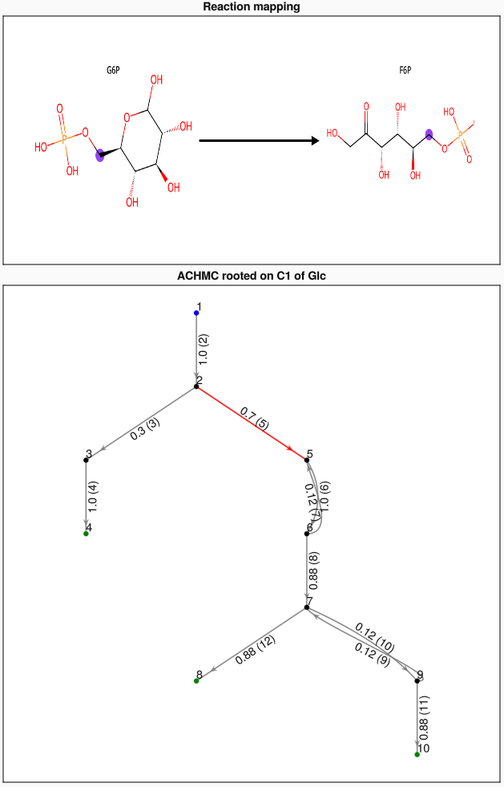

# ACHMC (for AEFMs; quickstart)

This section shows how to use the wrapper function in
MarkovWeightedEFMs.jl to enumerate and assign AEFMs weights in a simple,
multispecies reaction network.


```@setup required
# Bodge until I figure out how to install Python and RXMapper on Git workflows
using MarkovWeightedEFMs
using SparseArrays

S = [#
  1 -1  0  0  0  0  0  0  0  0  0  0  0  0  0  0 # Glc
  0 -1  0  0  0 -1  0  0  0  0  0  0  1  0  0  0 # ATP
  0  1 -1  0 -1  0  0  0  0  0  0  0  0  0  0  0 # G6P
  0  1  0  0  0  1  0  0  0  0  0  0  0 -1  0  0 # ADP
  0  0  1 -1  0  0  0  0  0  0  0  0  0  0  0  0 # 6PG
  0  0  0  0  1 -1  1  0  0  0  0  0  0  0  0  0 # F6P
  0  0  0  0  0  0  1  0  0  0  0  0  0  0 -1  0 # Pi
  0  0  0  0  0  0 -1  0  0  0  0  0  0  0  0  1 # H2O
  0  0  0  0  0  1 -1 -1  0  0  0  0  0  0  0  0 # FDP
  0  0  0  0  0  0  0  1 -1  1 -1  0  0  0  0  0 # G3P
  0  0  0  0  0  0  0  1  1 -1  0 -1  0  0  0  0 # DHAP
]

v = [10, 10, 3, 3, 7, 8, 1, 7, 1, 1, 7, 7, 18, 18, 1, 1]

mets = [#
  "Glc",
  "ATP",
  "G6P",
  "ADP",
  "6PG",
  "F6P",
  "Pi",
  "H2O",
  "FDP",
  "G3P",
  "DHAP"
]

rxns = [#
  "Source Glc",
  "Hexokinase",
  "G6P dehydrogenase",
  "Sink 6PG",
  "Phosphoglucose isomerase",
  "6-phosphofructo-1-kinase",
  "Fructose 1,6-bisphosphatase",
  "Fructose-bisphosphate aldolase",
  "Triose phosphate isomerase",
  "Triose phosphate isomerase",
  "Sink G3P",
  "Sink DHAP",
  "Source ATP",
  "Sink ADP",
  "Sink Pi",
  "Source H2O"
]

smiles = [#
  "C([C@@H]1[C@H]([C@@H]([C@H](C(O1)O)O)O)O)O",
  "C1=NC(=C2C(=N1)N(C=N2)[C@H]3[C@@H]([C@@H]([C@H](O3)COP(=O)(O)OP(=O)(O)OP(=O)(O)O)O)O)N",
  "C([C@@H]1[C@H]([C@@H]([C@H](C(O1)O)O)O)O)OP(=O)(O)O",
  "C1=NC(=C2C(=N1)N(C=N2)[C@H]3[C@@H]([C@@H]([C@H](O3)COP(=O)(O)OP(=O)(O)O)O)O)N",
  "O=C1O[C@H](COP(=O)(O)O)[C@@H](O)[C@H](O)[C@H]1O",
  "C([C@H]([C@H]([C@@H](C(=O)CO)O)O)O)OP(=O)(O)O",
  "[O-]P(=O)([O-])[O-]",
  "O",
  "C(C1C(C(C(O1)(COP(=O)(O)O)O)O)O)OP(=O)(O)O",
  "C([C@H](C=O)O)OP(=O)(O)O",
  "C(C(=O)COP(=O)(O)O)O"
]

atom = :C # carbon atom type for AEFMs

#mdl, atom_info, logs = preprocess_all_for_atomic_chmc(S, v, mets, rxns, smiles, atom)

model_errors = CHMCAtomicErrorSummary(#
    0.0,     #absolute_flux_error
    Vector{Int64}(), #reactions_duplicated
    Vector{Int64}(), #reactions_with_zero_flux
    Vector{Int64}(), #reactions_with_negative_flux
    Vector{Int64}(), #reactions_with_non_integer_stoichiometries
    Vector{Int64}([1, 13, 16]), #reactions_unimolecular_source_stoichiometry_one
    Vector{Int64}(), #reactions_unimolecular_source_stoichiometry_not_one
    Vector{Int64}(), #reactions_multimolecular_source_stoichiometry_one
    Vector{Int64}(), #reactions_multimolecular_source_stoichiometry_not_one
    Vector{Int64}([4, 11, 12, 14, 15]), #reactions_unimolecular_sink_stoichiometry_one
    Vector{Int64}(), #reactions_unimolecular_sink_stoichiometry_not_one
    Vector{Int64}(), #reactions_multimolecular_sink_stoichiometry_one
    Vector{Int64}(), #reactions_multimolecular_sink_stoichiometry_not_one
    Vector{Int64}(), #reactions_empty
    Vector{Int64}() #unused_metabolites
)

smiles_warnings = (#
    dropped_rows_pseudometabolites = Int64[],
    dropped_cols_pseudometabolites = Int64[],
    dropped_cols_rxnmapper_limit = Int64[]
)

logs = (model_errors = model_errors, smiles_warnings = smiles_warnings)

ks = [#
    (3, 2, 1, 3),
    (2, 2, 1, 6),
    (1, 2, 1, 2),
    (2, 5, 1, 2),
    (3, 3, 1, 5),
    (3, 4, 1, 5),
    (3, 6, 1, 3),
    (2, 6, 1, 6),
    (1, 6, 1, 2),
    (2, 7, 1, 6),
    (11, 3, 1, 10),
    (2, 9, 1, 2),
    (3, 1, 1, 5),
    (3, 2, 1, 5),
    (3, 5, 1, 3),
    (2, 5, 1, 6),
    (9, 3, 1, 7),
    (1, 5, 1, 2),
    (9, 4, 1, 7),
    (11, 1, 1, 10),
    (6, 3, 1, 6),
    (9, 3, 1, 8),
    (6, 4, 1, 6),
    (9, 4, 1, 8),
    (2, 3, 1, 2),
    (11, 2, 1, 10),
    (2, 4, 1, 2),
    (3, 6, 1, 5),
    (9, 1, 1, 7),
    (6, 1, 1, 6),
    (9, 1, 1, 8),
    (2, 9, 1, 6),
    (9, 2, 1, 7),
    (2, 1, 1, 2),
    (6, 2, 1, 6),
    (9, 2, 1, 8),
    (2, 8, 1, 2),
    (2, 10, 1, 2),
    (2, 2, 1, 2),
    (3, 5, 1, 5),
    (9, 6, 1, 7),
    (10, 3, 1, 9),
    (6, 6, 1, 6),
    (3, 3, 1, 3),
    (2, 3, 1, 6),
    (9, 6, 1, 8),
    (1, 3, 1, 2),
    (3, 4, 1, 3),
    (2, 4, 1, 6),
    (1, 4, 1, 2),
    (2, 6, 1, 2),
    (2, 7, 1, 2),
    (10, 1, 1, 9),
    (3, 1, 1, 3),
    (2, 1, 1, 6),
    (9, 5, 1, 7),
    (1, 1, 1, 2),
    (6, 5, 1, 6),
    (2, 8, 1, 6),
    (9, 5, 1, 8),
    (2, 10, 1, 6),
    (10, 2, 1, 9)
]

vs = [#
    (5, 2),
    (4, 2),
    (3, 2),
    (4, 5),
    (6, 2),
    (6, 1),
    (5, 4),
    (4, 6),
    (3, 6),
    (4, 7),
    (10, 3),
    (4, 9),
    (6, 6),
    (6, 5),
    (5, 5),
    (4, 5),
    (6, 5),
    (3, 5),
    (6, 6),
    (10, 2),
    (9, 6),
    (11, 1),
    (9, 5),
    (11, 2),
    (4, 3),
    (10, 1),
    (4, 4),
    (6, 4),
    (6, 2),
    (9, 2),
    (10, 1),
    (4, 9),
    (6, 1),
    (4, 1),
    (9, 1),
    (10, 2),
    (4, 8),
    (4, 10),
    (4, 2),
    (6, 3),
    (6, 3),
    (11, 3),
    (9, 4),
    (5, 1),
    (4, 3),
    (10, 3),
    (3, 3),
    (5, 6),
    (4, 4),
    (3, 4),
    (4, 6),
    (4, 7),
    (11, 2),
    (5, 3),
    (4, 1),
    (6, 4),
    (3, 1),
    (9, 3),
    (4, 8),
    (11, 3),
    (4, 10),
    (11, 1)
]
D_C = Dict(zip(ks, vs))

src_mets = [1, 2, 8]
max_src_mets_carbon = [6, 10, 0]

atom_info = (D = D_C, atom = :C, max_src_met_atoms = max_src_mets_carbon, src_mets = src_mets)

smiles = [
    "OC[C@H]1OC(O)[C@H](O)[C@@H](O)[C@@H]1O"
    "Nc1ncnc2c1ncn2[C@@H]1O[C@H](COP(=O)(O)OP(=O)(O)OP(=O)(O)O)[C@@H](O)[C@H]1O"
    "O=P(O)(O)OC[C@H]1OC(O)[C@H](O)[C@@H](O)[C@@H]1O"
    "Nc1ncnc2c1ncn2[C@@H]1O[C@H](COP(=O)(O)OP(=O)(O)O)[C@@H](O)[C@H]1O"
    "O=C1O[C@H](COP(=O)(O)O)[C@@H](O)[C@H](O)[C@H]1O"
    "O=C(CO)[C@@H](O)[C@H](O)[C@H](O)COP(=O)(O)O"
    "O=P([O-])([O-])[O-]"
    "O"
    "O=P(O)(O)OCC1OC(O)(COP(=O)(O)O)C(O)C1O"
    "O=C[C@H](O)COP(=O)(O)O"
    "O=C(CO)COP(=O)(O)O"
]

rs = [#
    ">>OC[C@H]1OC(O)[C@H](O)[C@@H](O)[C@@H]1O",
    "OC[C@H]1OC(O)[C@H](O)[C@@H](O)[C@@H]1O.Nc1ncnc2c1ncn2[C@@H]1O[C@H](COP(=O)(O)OP(=O)(O)OP(=O)(O)O)[C@@H](O)[C@H]1O>>O=P(O)(O)OC[C@H]1OC(O)[C@H](O)[C@@H](O)[C@@H]1O.Nc1ncnc2c1ncn2[C@@H]1O[C@H](COP(=O)(O)OP(=O)(O)O)[C@@H](O)[C@H]1O",
    "O=P(O)(O)OC[C@H]1OC(O)[C@H](O)[C@@H](O)[C@@H]1O>>O=C1O[C@H](COP(=O)(O)O)[C@@H](O)[C@H](O)[C@H]1O",
    "O=C1O[C@H](COP(=O)(O)O)[C@@H](O)[C@H](O)[C@H]1O>>",
    "O=P(O)(O)OC[C@H]1OC(O)[C@H](O)[C@@H](O)[C@@H]1O>>O=C(CO)[C@@H](O)[C@H](O)[C@H](O)COP(=O)(O)O",
    "Nc1ncnc2c1ncn2[C@@H]1O[C@H](COP(=O)(O)OP(=O)(O)OP(=O)(O)O)[C@@H](O)[C@H]1O.O=C(CO)[C@@H](O)[C@H](O)[C@H](O)COP(=O)(O)O>>Nc1ncnc2c1ncn2[C@@H]1O[C@H](COP(=O)(O)OP(=O)(O)O)[C@@H](O)[C@H]1O.O=P(O)(O)OCC1OC(O)(COP(=O)(O)O)C(O)C1O",
    "O.O=P(O)(O)OCC1OC(O)(COP(=O)(O)O)C(O)C1O>>O=C(CO)[C@@H](O)[C@H](O)[C@H](O)COP(=O)(O)O.O=P([O-])([O-])[O-]",
    "O=P(O)(O)OCC1OC(O)(COP(=O)(O)O)C(O)C1O>>O=C[C@H](O)COP(=O)(O)O.O=C(CO)COP(=O)(O)O",
    "O=C[C@H](O)COP(=O)(O)O>>O=C(CO)COP(=O)(O)O",
    "O=C(CO)COP(=O)(O)O>>O=C[C@H](O)COP(=O)(O)O",
    "O=C[C@H](O)COP(=O)(O)O>>",
    "O=C(CO)COP(=O)(O)O>>",
    ">>Nc1ncnc2c1ncn2[C@@H]1O[C@H](COP(=O)(O)OP(=O)(O)OP(=O)(O)O)[C@@H](O)[C@H]1O",
    "Nc1ncnc2c1ncn2[C@@H]1O[C@H](COP(=O)(O)OP(=O)(O)O)[C@@H](O)[C@H]1O>>",
    "O=P([O-])([O-])[O-]>>",
    ">>O"
]

ms = [#
    "",
    "[OH:5][CH2:6][C@H:7]1[O:8][CH:9]([OH:10])[C@H:11]([OH:12])[C@@H:13]([OH:14])[C@@H:15]1[OH:16].[NH2:17][c:18]1[n:19][cH:20][n:21][c:22]2[c:23]1[n:24][cH:25][n:26]2[C@@H:27]1[O:28][C@H:29]([CH2:30][O:31][P:32](=[O:33])([OH:34])[O:35][P:36](=[O:37])([OH:38])[O:39][P:2](=[O:1])([OH:3])[OH:4])[C@@H:40]([OH:41])[C@H:42]1[OH:43]>>[O:1]=[P:2]([OH:3])([OH:4])[O:5][CH2:6][C@H:7]1[O:8][CH:9]([OH:10])[C@H:11]([OH:12])[C@@H:13]([OH:14])[C@@H:15]1[OH:16].[NH2:17][c:18]1[n:19][cH:20][n:21][c:22]2[c:23]1[n:24][cH:25][n:26]2[C@@H:27]1[O:28][C@H:29]([CH2:30][O:31][P:32](=[O:33])([OH:34])[O:35][P:36](=[O:37])([OH:38])[OH:39])[C@@H:40]([OH:41])[C@H:42]1[OH:43]",
    "[O:8]=[P:7]([OH:9])([OH:10])[O:6][CH2:5][C@H:4]1[O:3][CH:2]([OH:1])[C@H:15]([OH:16])[C@@H:13]([OH:14])[C@@H:11]1[OH:12]>>[O:1]=[C:2]1[O:3][C@H:4]([CH2:5][O:6][P:7](=[O:8])([OH:9])[OH:10])[C@@H:11]([OH:12])[C@H:13]([OH:14])[C@H:15]1[OH:16]",
    "",
    "[O:14]=[P:13]([OH:15])([OH:16])[O:12][CH2:11][C@H:9]1[O:10][CH:3]([OH:4])[C@H:2]([OH:1])[C@@H:5]([OH:6])[C@@H:7]1[OH:8]>>[O:1]=[C:2]([CH2:3][OH:4])[C@@H:5]([OH:6])[C@H:7]([OH:8])[C@H:9]([OH:10])[CH2:11][O:12][P:13](=[O:14])([OH:15])[OH:16]",
    "[NH2:1][c:2]1[n:3][cH:4][n:5][c:6]2[c:7]1[n:8][cH:9][n:10]2[C@@H:11]1[O:12][C@H:13]([CH2:14][O:15][P:16](=[O:17])([OH:18])[O:19][P:20](=[O:21])([OH:22])[O:23][P:29](=[O:28])([OH:30])[OH:31])[C@@H:24]([OH:25])[C@H:26]1[OH:27].[O:35]=[C:34]([CH2:33][OH:32])[C@@H:46]([OH:47])[C@H:44]([OH:45])[C@H:36]([OH:37])[CH2:38][O:39][P:40](=[O:41])([OH:42])[OH:43]>>[NH2:1][c:2]1[n:3][cH:4][n:5][c:6]2[c:7]1[n:8][cH:9][n:10]2[C@@H:11]1[O:12][C@H:13]([CH2:14][O:15][P:16](=[O:17])([OH:18])[O:19][P:20](=[O:21])([OH:22])[OH:23])[C@@H:24]([OH:25])[C@H:26]1[OH:27].[O:28]=[P:29]([OH:30])([OH:31])[O:32][CH2:33][CH:34]1[O:35][C:36]([OH:37])([CH2:38][O:39][P:40](=[O:41])([OH:42])[OH:43])[CH:44]([OH:45])[CH:46]1[OH:47]",
    "[OH2:20].[O:17]=[P:18]([OH:19])([OH:21])[O:4][CH2:3][CH:2]1[O:1][C:9]([OH:10])([CH2:11][O:12][P:13](=[O:14])([OH:15])[OH:16])[CH:7]([OH:8])[CH:5]1[OH:6]>>[O:1]=[C:2]([CH2:3][OH:4])[C@@H:5]([OH:6])[C@H:7]([OH:8])[C@H:9]([OH:10])[CH2:11][O:12][P:13](=[O:14])([OH:15])[OH:16].[O:17]=[P:18]([O-:19])([O-:20])[O-:21]",
    "[O:18]=[P:17]([OH:19])([OH:20])[O:1][CH2:2][CH:3]1[O:4][C:12]([OH:11])([CH2:13][O:14][P:7](=[O:8])([OH:9])[OH:10])[CH:15]([OH:16])[CH:5]1[OH:6]>>[O:1]=[CH:2][C@H:3]([OH:4])[CH2:5][O:6][P:7](=[O:8])([OH:9])[OH:10].[O:11]=[C:12]([CH2:13][OH:14])[CH2:15][O:16][P:17](=[O:18])([OH:19])[OH:20]",
    "[O:4]=[CH:3][C@H:2]([OH:1])[CH2:5][O:6][P:7](=[O:8])([OH:9])[OH:10]>>[O:1]=[C:2]([CH2:3][OH:4])[CH2:5][O:6][P:7](=[O:8])([OH:9])[OH:10]",
    "[O:1]=[C:2]([CH2:3][OH:4])[CH2:5][O:6][P:7](=[O:8])([OH:9])[OH:10]>>[O:4]=[CH:3][C@H:2]([OH:1])[CH2:5][O:6][P:7](=[O:8])([OH:9])[OH:10]",
    "",
    "",
    "",
    "",
    "",
    ""
]

mdl = (S = Int16.(S), ms = ms, rxns = rxns, v = Float64.(v), mets = mets, rs = rs, smiles = smiles)

I = (1, 1, atom)
ks = Int16.([5, 4, 6, 7, 2, 8, 3, 1])
vs = [(Int16(6), Int16(6)), (Int16(0), Int16(0)), (Int16(9), Int16(4)), (Int16(11), Int16(2)), (Int16(3), Int16(1)), (Int16(10), Int16(1)), (Int16(5), Int16(3)), (Int16(1), Int16(1))]
dmc = Dict(zip(ks, vs))

ks = [#
    Int16.([1, 2, 5, 6, 7]),
    Int16.([1, 2, 5, 6]),
    Int16.([1, 2, 5, 6, 7, 4]),
    Int16.([1]),
    Int16.([1, 2, 3]),
    Int16.([1, 2, 3, 4]),
    Int16.([1, 2]),
    Int16.([1, 2, 5]),
    Int16.([1, 2, 5, 6, 7, 8]),
    Int16.([1, 2, 5, 6, 7, 8, 4])
]
vs = [#
    (id = 7, children = Int16.([8])),
    (id = 6, children = Int16.([7])),
    (id = 8, children = Int16.([])),
    (id = 1, children = Int16.([2])),
    (id = 3, children = Int16.([])),
    (id = 4, children = Int16.([])),
    (id = 2, children = Int16.([3, 5])),
    (id = 5, children = Int16.([6])),
    (id = 9, children = Int16.([])),
    (id = 10, children = Int16.([]))
]
dchmc = Dict(zip(ks, vs))

T = SparseMatrixCSC([
    0 1.0 0 0 0 0 0 0 0 0
    0 0 0.3 0 0.7 0 0 0 0 0
    0 0 0 1.0 0 0 0 0 0 0
    1.0 0 0 0 0 0 0 0 0 0
    0 0 0 0 0 1.0 0 0 0 0
    0 0 0 0 0.125 0 0.875 0 0 0
    0 0 0 0 0 0 0 0.875 0.125 0
    1.0 0 0 0 0 0 0 0 0 0
    0 0 0 0 0 0 0.125 0 0 0.875
    1.0 0 0 0 0 0 0 0 0 0
])

R = [#
    (i = 1, j = 2, k = Int16(2)),
    (i = 2, j = 3, k = Int16(3)),
    (i = 2, j = 5, k = Int16(5)),
    (i = 3, j = 4, k = Int16(4)),
    (i = 4, j = 1, k = Int16(4)),
    (i = 5, j = 6, k = Int16(6)),
    (i = 6, j = 5, k = Int16(7)),
    (i = 6, j = 7, k = Int16(8)),
    (i = 7, j = 8, k = Int16(12)),
    (i = 8, j = 1, k = Int16(12)),
    (i = 7, j = 9, k = Int16(10)),
    (i = 9, j = 10, k = Int16(11)),
    (i = 10, j = 1, k = Int16(11)),
    (i = 9, j = 7, k = Int16(9))
]

res = CHMCAtomicSummary(#
    (1, 1, :C),
    [#
        (EFM = [6, 5, 6], Closures = [(6, 5)]),
        (EFM = [4, 1, 2, 5, 6, 7, 4], Closures = [(8, 1)]),
        (EFM = [4, 1, 2, 3, 4], Closures = [(4, 1)]),
        (EFM = [8, 7, 8], Closures = [(9, 7)]),
        (EFM = [4, 1, 2, 5, 6, 7, 8, 4], Closures = [(10, 1)])
    ],
    [0.09000000000000001, 0.56, 0.27, 0.01, 0.07],
    [1.0, 6.222222222222222, 3.0, 0.11111111111111112, 0.7777777777777778],
    dmc,
    dchmc,
    T,
    R
)

res_enum = CHMCAtomicSummary(#
    (1, 1, :C),
    [#
        (EFM = [6, 5, 6], Closures = [(6, 5)]),
        (EFM = [4, 1, 2, 5, 6, 7, 4], Closures = [(8, 1)]),
        (EFM = [4, 1, 2, 3, 4], Closures = [(4, 1)]),
        (EFM = [8, 7, 8], Closures = [(9, 7)]),
        (EFM = [4, 1, 2, 5, 6, 7, 8, 4], Closures = [(10, 1)])
    ],
    nothing,
    nothing,
    dmc,
    dchmc,
    T,
    R
)

efm_seq_1 = ["FDP", "F6P", "FDP"]
efm_seq_2 = ["Glc", "G6P", "F6P", "FDP", "DHAP"]
```

## Inputs

```julia
using MarkovWeightedEFMs
S = [#
  1 -1  0  0  0  0  0  0  0  0  0  0  0  0  0  0 # Glc
  0 -1  0  0  0 -1  0  0  0  0  0  0  1  0  0  0 # ATP
  0  1 -1  0 -1  0  0  0  0  0  0  0  0  0  0  0 # G6P
  0  1  0  0  0  1  0  0  0  0  0  0  0 -1  0  0 # ADP
  0  0  1 -1  0  0  0  0  0  0  0  0  0  0  0  0 # 6PG
  0  0  0  0  1 -1  1  0  0  0  0  0  0  0  0  0 # F6P
  0  0  0  0  0  0  1  0  0  0  0  0  0  0 -1  0 # Pi
  0  0  0  0  0  0 -1  0  0  0  0  0  0  0  0  1 # H2O
  0  0  0  0  0  1 -1 -1  0  0  0  0  0  0  0  0 # FDP
  0  0  0  0  0  0  0  1 -1  1 -1  0  0  0  0  0 # G3P
  0  0  0  0  0  0  0  1  1 -1  0 -1  0  0  0  0 # DHAP
]

v = [10, 10, 3, 3, 7, 8, 1, 7, 1, 1, 7, 7, 18, 18, 1, 1]

mets = [#
  "Glc",
  "ATP",
  "G6P",
  "ADP",
  "6PG",
  "F6P",
  "Pi",
  "H2O",
  "FDP",
  "G3P",
  "DHAP"
]

rxns = [#
  "Source Glc",
  "Hexokinase",
  "G6P dehydrogenase",
  "Sink 6PG",
  "Phosphoglucose isomerase",
  "6-phosphofructo-1-kinase",
  "Fructose 1,6-bisphosphatase",
  "Fructose-bisphosphate aldolase",
  "Triose phosphate isomerase",
  "Triose phosphate isomerase",
  "Sink G3P",
  "Sink DHAP",
  "Source ATP",
  "Sink ADP",
  "Sink Pi",
  "Source H2O"
]

smiles = [#
  "C([C@@H]1[C@H]([C@@H]([C@H](C(O1)O)O)O)O)O",
  "C1=NC(=C2C(=N1)N(C=N2)[C@H]3[C@@H]([C@@H]([C@H](O3)COP(=O)(O)OP(=O)(O)OP(=O)(O)O)O)O)N",
  "C([C@@H]1[C@H]([C@@H]([C@H](C(O1)O)O)O)O)OP(=O)(O)O",
  "C1=NC(=C2C(=N1)N(C=N2)[C@H]3[C@@H]([C@@H]([C@H](O3)COP(=O)(O)OP(=O)(O)O)O)O)N",
  "O=C1O[C@H](COP(=O)(O)O)[C@@H](O)[C@H](O)[C@H]1O",
  "C([C@H]([C@H]([C@@H](C(=O)CO)O)O)O)OP(=O)(O)O",
  "[O-]P(=O)([O-])[O-]",
  "O",
  "C(C1C(C(C(O1)(COP(=O)(O)O)O)O)O)OP(=O)(O)O",
  "C([C@H](C=O)O)OP(=O)(O)O",
  "C(C(=O)COP(=O)(O)O)O"
]

atom = :C # carbon atom type for AEFMs
```

We can check that the flux vector satisfies the steady state requirements.

```@example required
all(S * v .== 0) # should evaluate as true
```


## Pre-processing data (wrapper)

The following function pre-processes the input metabolic network for
computing the AEFM weights for the specified atom type.

```julia
mdl, atom_info, logs = preprocess_all_for_atomic_chmc(S, v, mets, rxns, smiles, atom)
```

The variable `mdl` is a NamedTuple containing the updated stoichiometry
matrix, flux vector, metabolite/reaction names, metabolite SMILES strings,
reaction SMILES strings, and mapped reaction SMILES strings.

```@example required
keys(mdl)
```

The variable `logs` contains details about input metabolic network in
addition to listing the pseudometabolites and pseudoreactions dropped from
the network based on the input SMILES strings.

```@example required
keys(logs)
```

```@example required
print(logs.model_errors)
```

```@example required
logs.smiles_warnings
```

The variable `atom_info` contains the indices of all source metabolites in
the updated network and the number of occurrences for the input atom of
interest. It also contains an atom-mapping dictionary relating substrate-atom
positions to product-atom positions in each reaction. These are useful
for programmatically computing AEFMs across all source metabolite-atom
combinations of interest.

```@example required
keys(atom_info)
```

```@example required
atom_info.src_mets # source metabolite indices
```

```@example required
atom_info.max_src_met_atoms # counts of specified atom in each source metabolite
```

```@example required
atom_info.D # atom-mapping dictionary
```

## Computing ACHMC for a given metabolite/carbon atom state

The following atomic CHMC is rooted on the first carbon atom of the first
source metabolite in the stoichiometry.

```julia
I = (atom_info.src_mets[1], 1, atom) # initial state is 1st carbon of canonicalized glucose
res = steady_state_efm_distribution(mdl.S, mdl.v, mdl.ms, I, atom_info.D; verbose = false) # S must be Matrix{Int16}
```
```@example required
res
```

If we only wanted to enumerate the AEFMs, we would run:

```julia
res_enum = enumerate_atomic_efms(mdl.S, mdl.ms, I, atom_info.D, verbose = false)
```

Both functions produce the same output structure `res`, except that the
AEFM flux decomposition fields will be empty. The transition matrix will
also default to uniformly distributed probabilities along each row.

### Output

The output `res` is an immutable struct with 8 fields:

`res.i` is a tuple storing (i) the source metabolite index, (ii) source
metabolite atom index (based on canonicalized SMILES string), and (iii)
the atom type. This is a copy of the variable `I`.

```@example required
res.i
```

`res.e` is an array of AEFMs with all corresponding simple cycle closures.

```@example required
res.e
```

`res.p` is an array of AEFM probabilities normalized to one.

```@example required
res.p
```

`res.w` is an array of AEFM weights normalized by the (unimolecular)
reaction flux of the source metabolite.

```@example required
res.w
```

`res.dchmc` is a dictionary storing the ACHMC. The keys are the ACHMC
states (composed of Markov chain states in `res.dmc`). The values are the
ACHMC state and the Markov chain state children.

```@example required
res.dchmc
```

`res.dmc` is a dictionary converting Markov chain states to
metabolite-atom positions. The value `(0, 0)` always corresponds to the
external environment sink node (which connects back to the source
metabolite-atom state).

```@example required
res.dmc
```

`res.T` is a sparse array storing the ACHMC transition probability matrix.

```@example required
res.T
```

`res.R` is an array of tuples storing the reaction index/indices mapped to
each ACHMC transition matrix element.

```@example required
res.R
```

## Converting AEFM to sequence of metabolites

The corresponding AEFMs correspond to the movement of
metabolite/atom states through the reaction network. We can convert these
states into metabolites using `get_efm_metabolite_atom_indices`.  Note
that there is one fewer metabolite name than AEFM metabolite indices
because the pseudometabolite `(0, 0)` linking sink and source reactions is
omitted.

```julia
# First AEFM
efm_seq_1 = mets[first.(get_efm_metabolite_atom_indices(res, 1))]
```
```@example required
efm_seq_1
```

```julia
# Second AEFM
efm_seq_2 = mets[first.(get_efm_metabolite_atom_indices(res, 2))]
```
```@example required
efm_seq_2
```

## Visualizing the CHMC and mapped reactions

The following plotting function visualizes the ACHMC rooted on state `I`.
This is only recommended for exploring ACHMCs of small networks.

```julia
using GLMakie # Makie backend
GLMakie.activate!()

plot_atomic_chmc(res, S, mets, rs)
```

Each node in the main panel corresponds to a CHMC state
(metabolite and atomic index).


Clicking on a CHMC transition will highlight
that transition and display the corresponding metabolic reaction on the upper
panel. The pair of purple highlighted atoms correspond to the movement of the
same atom from the LHS to RHS of the reaction.



Finally, the reaction and mapped reaction SMILES strings can also be plotted as
an SVG and previewed using a package like ElectronDisplay. If `fname != ""`,
the SVG is also saved to file. By default, `fname == ""` and the SVG is
not saved. The default canvas width and height are 1420 by 580 (pixels)
but these can be changed. If using ElectronDisplay and the image is cut
off, try resizing the plotting window or reducing the canvas dimensions.

```julia
using ElectronDisplay

# Reaction string
plot_mapped_reaction(rs[2], view=true, canvas_width = 1420, canvas_height = 580)
#plot_mapped_reaction(rs[2], "\path\to\save\name.svg", view=true)
```


```julia
# Mapped reaction string
plot_mapped_reaction(ms[2], view = true, canvas_width = 1420, canvas_height = 580)
#plot_mapped_reaction(ms[2], "\path\to\save\name.svg", view = true)
```


