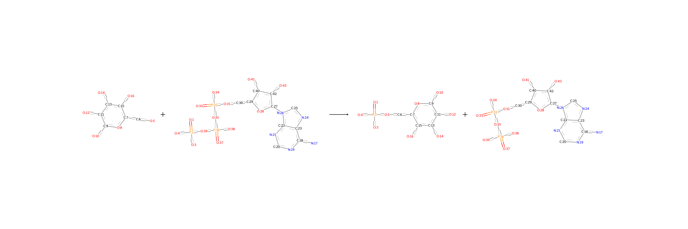

# ACHMC (for AEFMs)

This section shows how to use the functions in MarkovWeightedEFMs.jl to
enumerate and assign AEFMs weights in a simple multispecies reaction
network.


## Inputs

```julia
using MarkovWeightedEFMs
S = [#
  1 -1  0  0  0  0  0  0  0  0  0  0  0  0  0  0 # Glc
  0 -1  0  0  0 -1  0  0  0  0  0  0  1  0  0  0 # ATP
  0  1 -1  0 -1  0  0  0  0  0  0  0  0  0  0  0 # G6P
  0  1  0  0  0  1  0  0  0  0  0  0  0 -1  0  0 # ADP
  0  0  1 -1  0  0  0  0  0  0  0  0  0  0  0  0 # 6PG
  0  0  0  0  1 -1  1  0  0  0  0  0  0  0  0  0 # F6P
  0  0  0  0  0  0  1  0  0  0  0  0  0  0 -1  0 # Pi
  0  0  0  0  0  0 -1  0  0  0  0  0  0  0  0  1 # H2O
  0  0  0  0  0  1 -1 -1  0  0  0  0  0  0  0  0 # FDP
  0  0  0  0  0  0  0  1 -1  1 -1  0  0  0  0  0 # G3P
  0  0  0  0  0  0  0  1  1 -1  0 -1  0  0  0  0 # DHAP
]

v = [10, 10, 3, 3, 7, 8, 1, 7, 1, 1, 7, 7, 18, 18, 1, 1]

mets = [#
  "Glc",
  "ATP",
  "G6P",
  "ADP",
  "6PG",
  "F6P",
  "Pi",
  "H2O",
  "FDP",
  "G3P",
  "DHAP"
]

rxns = [#
  "Source Glc",
  "Hexokinase",
  "G6P dehydrogenase",
  "Sink 6PG",
  "Phosphoglucose isomerase",
  "6-phosphofructo-1-kinase",
  "Fructose 1,6-bisphosphatase",
  "Fructose-bisphosphate aldolase",
  "Triose phosphate isomerase",
  "Triose phosphate isomerase",
  "Sink G3P",
  "Sink DHAP",
  "Source ATP",
  "Sink ADP",
  "Sink Pi",
  "Source H2O"
]

smiles = [#
  "C([C@@H]1[C@H]([C@@H]([C@H](C(O1)O)O)O)O)O",
  "C1=NC(=C2C(=N1)N(C=N2)[C@H]3[C@@H]([C@@H]([C@H](O3)COP(=O)(O)OP(=O)(O)OP(=O)(O)O)O)O)N",
  "C([C@@H]1[C@H]([C@@H]([C@H](C(O1)O)O)O)O)OP(=O)(O)O",
  "C1=NC(=C2C(=N1)N(C=N2)[C@H]3[C@@H]([C@@H]([C@H](O3)COP(=O)(O)OP(=O)(O)O)O)O)N",
  "O=C1O[C@H](COP(=O)(O)O)[C@@H](O)[C@H](O)[C@H]1O",
  "C([C@H]([C@H]([C@@H](C(=O)CO)O)O)O)OP(=O)(O)O",
  "[O-]P(=O)([O-])[O-]",
  "O",
  "C(C1C(C(C(O1)(COP(=O)(O)O)O)O)O)OP(=O)(O)O",
  "C([C@H](C=O)O)OP(=O)(O)O",
  "C(C(=O)COP(=O)(O)O)O"
]
```

We can check that the flux vector satisfies the steady state requirements.

```julia
all(S * v .== 0) # should evaluate as true
```

## Pre-processing data

The following functions check for issues with the inputs. The first function
`find_atomic_chmc_input_errors` identifies possible problems with the
stoichiometry matrix and flux vector. These problems, except for the steady
state flux requirement, can be addressed via `correct_atomic_chmc_input_errors`.
Finally, the last function `correct_atomic_chmc_input_smiles` checks and fixes
problems relating to the SMILES strings.

```julia
# Confirm there are no issues with stoichiometry matrix 
errors = find_atomic_chmc_input_errors(S, v)
print(errors) # summary of errors associated with S/v

# S and v have no errors so the inputs are returned
correct_atomic_chmc_input_errors(errors, S, mets, rxns)
# S, mets, rxns = correct_atomic_chmc_input_errors(errors, S, mets, rxns) # otherwise

# Correct issues associated with RXNMapper character limit and pseudometabolites
S, v, mets, rxns, smiles, logs = correct_atomic_chmc_input_smiles(S, v, mets, rxns, smiles)
```

At this point, the SMILES strings (matching the updated `mets` if there were
errors in the initial inputs) should be canonicalized.

```julia
smiles = canonicalize_smiles(smiles)
```

## Atom mapping reactions

The reaction SMILES strings are next constructed from the metabolite SMILES and
the atom mapping is performed via RXNMapper. In this tutorial, we will be
constructing an atomic CHMC rooted on a particular source metabolite carbon.
We precompute an atom tracing dictionary mapping the (carbon) atom in the
stoichiometric copy of a substrate to its product across each reaction.

```julia
# Construct atom traced SMILES strings
rs, ms = map_reaction_strings(S, smiles, rxns, false)

# Precompute atom tracing dictionary
atom = :C # carbon
atom_max = get_max_atoms(smiles, atom)
D_C = precompute_atom_tracing_dictionary(S, ms, atom_max, atom)

# Identify source metabolites
src_mets = get_source_metabolites(S)
max_src_met_carbons = atom_max[src_mets]
nothing # hide
```

## Computing ACHMC for a given metabolite/carbon atom state

The following atomic CHMC is rooted on the first carbon atom of the first
source metabolite in the stoichiometry matrix 6-phospho-D-gluconate.

```julia
I = (src_mets[1], 1, atom) # initial state is 1st carbon of canonicalized glucose
res = steady_state_efm_distribution(S, v, ms, I, D_C; verbose = false)
```

If we only wanted to enumerate the AEFMs, we would run:

```julia
enumerate_atomic_efms(S, ms, I, D_C, verbose = false)
```

Both functions produce the same output structure `res`, except that the
AEFM flux decomposition field will be a vector of zeros.


## Converting AEFM to sequence of metabolites

The corresponding AEFMs correspond to the movement of
metabolite/atom states through the reaction network. We can convert these
states into metabolites using `get_efm_metabolite_atom_indices`.  Note
that there is one fewer metabolite name than AEFM metabolite indices
because the pseudometabolite `(0, 0)` linking sink and source reactions is
omitted.

```julia
# First AEFM
mets[first.(get_efm_metabolite_atom_indices(res, 1))]
```

```julia
# Second AEFM
mets[first.(get_efm_metabolite_atom_indices(res, 2))]
```

## Visualizing the CHMC and mapped reactions

The following plotting function visualizes the ACHMC rooted on state `I`.
This is only recommended for exploring ACHMCs of small networks.

```julia
using GLMakie # Makie backend
GLMakie.activate!()

plot_atomic_chmc(res, S, mets, rs)
```

Each node in the main panel corresponds to a CHMC state
(metabolite and atomic index).


Clicking on a CHMC transition will highlight
that transition and display the corresponding metabolic reaction on the upper
panel. The pair of purple highlighted atoms correspond to the movement of the
same atom from the LHS to RHS of the reaction.


Finally, the reaction and mapped reaction SMILES strings can also be plotted as
an SVG and previewed using a package like ElectronDisplay. If `fname != ""`,
the SVG is also saved to file. By default, `fname == ""` and the SVG is not
saved.

```julia
using ElectronDisplay

# Reaction string
plot_mapped_reaction(rs[2], view=true)
#plot_mapped_reaction(rs[2], "\path\to\save\name.svg", view=true)
```


```julia
# Mapped reaction string
plot_mapped_reaction(ms[2], view=true)
#plot_mapped_reaction(ms[2], "\path\to\save\name.svg", view=true)
```




