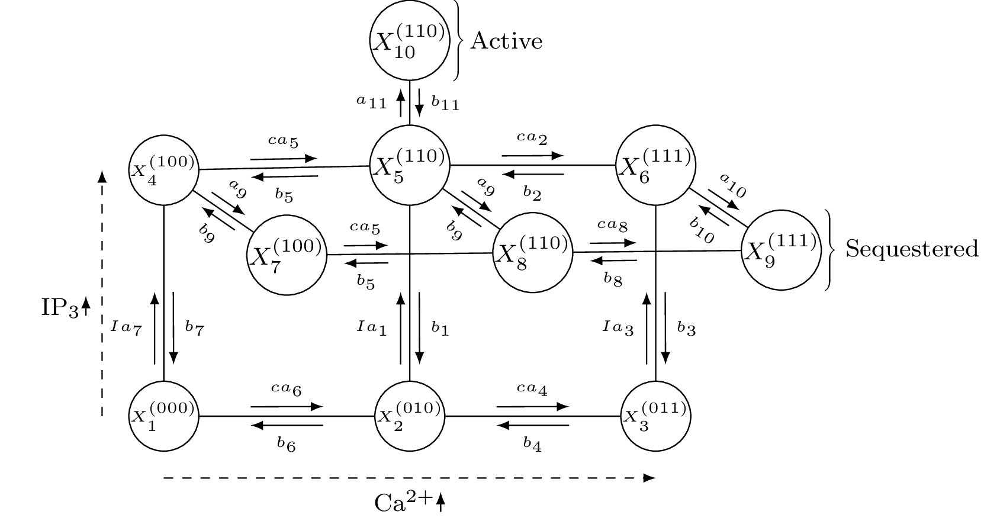
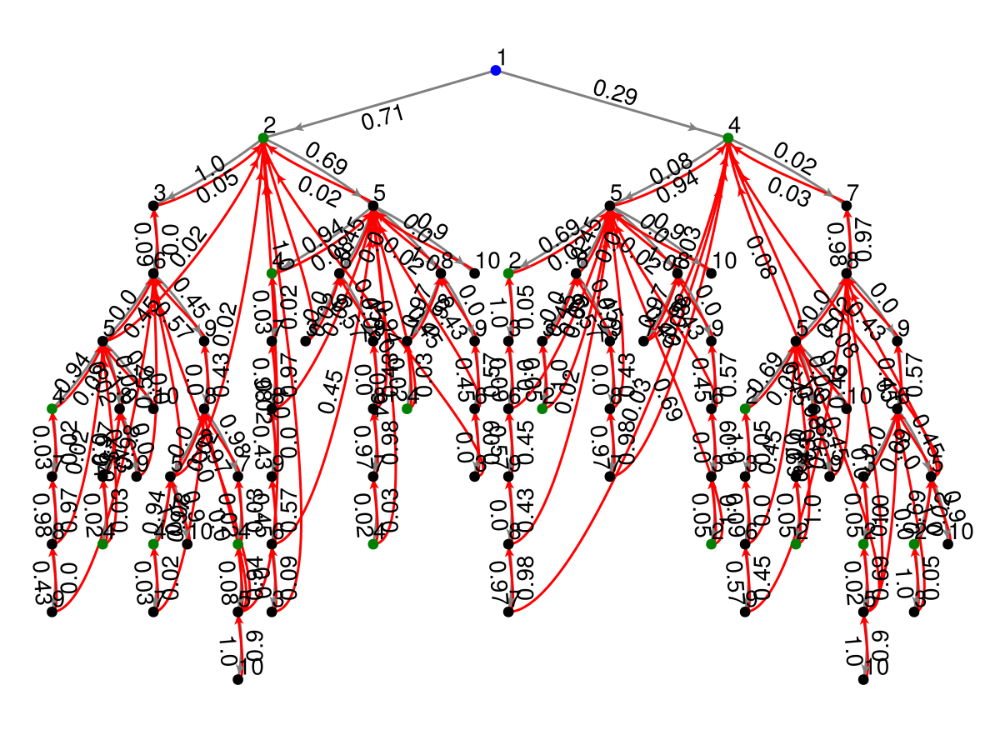

# CHMC (ion channels)

This section demonstrates how to use the functions in MarkovWeightedEFMs.jl
to analyze the steady state dynamics of the following ion channel with three
possible binding sites reproduced from (Bicknell and Goodhill)[https://doi.org/10.1073/pnas.1604090113].



```@setup required
using MarkovWeightedEFMs
```

## Markov state model of IP3 channel activity

### Rate constants

```@example required
using MarkovWeightedEFMs

# Parameters
c   = 0.1 # Ca2+ (uM)
I   = 0.1 # IP3 (uM)
a1  = 50
a2  = 0.035
a4  = 3.5
a5  = 65
a6  = 25
a7  = 10
a8  = 0.035
a9  = 0.15
a10 = 1.25
a11 = 110
b1  = 2.5
b2  = 1.25
b3  = 0.25
b4  = 12.5
b5  = 10
b7  = 0.25
b9  = 0.2
b10 = 2.5
b11 = 20
K1  = b1 / a1
K2  = b2 / a2
K4  = b4 / a4
K5  = b5 / a5
K7  = b7 / a7
K9  = b9 / a9
K10 = b10 / a10
a3  = (b3 * K4) / (K1 * K2)
b6  = (a6 * K5 * K7) / K1
b8  = (a8 * K2 * K10) / K9
nothing # hide
```

### Generator and transition matrix

```@example required
# Markov transition rate matrix
Q = [#
  0  c*a6 0    I*a7 0    0    0  0    0    0
  b6 0    c*a4 0    I*a1 0    0  0    0    0
  0  b4   0    0    0    I*a3 0  0    0    0
  b7 0    0    0    c*a5 0    a9 0    0    0
  0  b1   0    b5   0    c*a2 0  a9   0    a11
  0  0    b3   0    b2   0    0  0    a10  0
  0  0    0    b9   0    0    0  c*a5 0    0
  0  0    0    0    b9   0    b5 0    c*a8 0
  0  0    0    0    0    b10  0  b8   0    0
  0  0    0    0    b11  0    0  0    0    0
];

# Markov transition probability matrix
T = Q ./ sum(Q, dims=2)
```

## Enumerating EFMs and computing their probabilities

The Markov state model contains 39 EFMs. If one were to simulate trajectories
from this model for an infinite period of time and decompose these trajectories
into simple cycles, the resulting frequencies would converge on the following
EFM probabilities. For example, the active-inactive-active transition involving
states 10-5-10 occurs ~83.8% of the time on average in this model.

```@example required
res = steady_state_efm_distribution(T);

# EFMs/simple cycles and their corresponding probabilities
reduce(hcat, [res.e, res.p])
```

## Visualizing the CHMC

The blue node represents state 1 and is the root of the tree. All green nodes
return back to the blue node but these arrows are hidden to limit visual clutter.

```julia
using GLMakie
GLMakie.activate!()
plot_chmc(T, 1) # arbitrarily rooted on state 1
```



