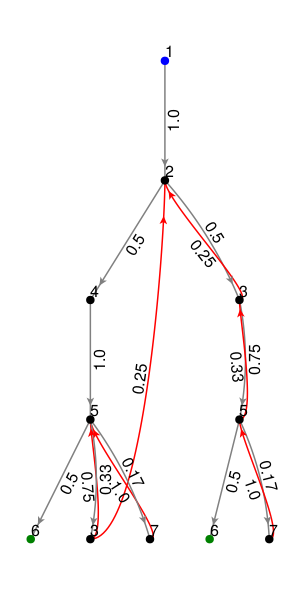
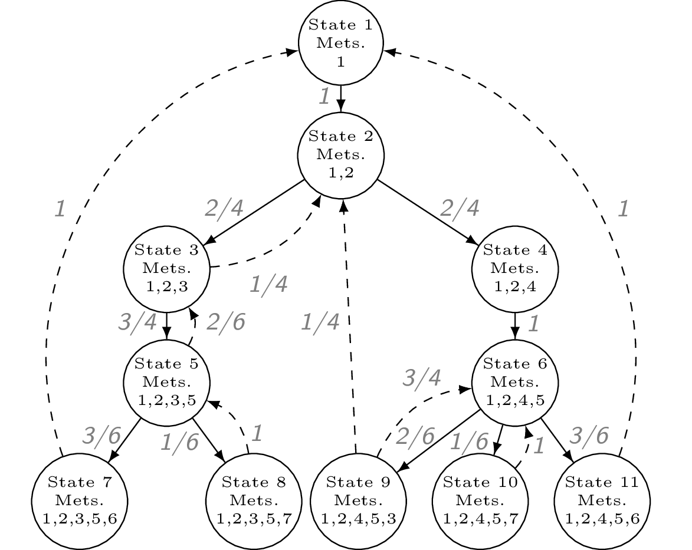

# CHMC (metabolic networks)

This section demonstrates how to use the functions in MarkovWeightedEFMs.jl
to analyze the following unimolecular reaction network.


```@setup required
using MarkovWeightedEFMs
```

## Problem statement

Given the metabolic network above, its steady state fluxes, and its
elementary flux modes (EFMs), what is the set of EFM weights that
reconstructs the observed network fluxes?

## Inputs

For this type of problem, we require the following:

1. Stoichiometry matrix of unimolecular reactions
   (must be unimolecular and strongly-connected; either open or closed loop)
2. Steady state fluxes along each reaction.

The network metabolites and reactions are typically encoded in an $m$ by
$r$ stoichiometry matrix `S`. The steady state flux vector is stored as a
separate vector.

```@example required
using MarkovWeightedEFMs # load package

# Stoichiometry matrix and flux vector for the example network
S = [#
 -1  0  0  0  0  0  0  0  0  0  1
  1 -1  1 -1  0  0  0  0  0  0  0
  0  1 -1  0 -1  1  0  0  0  0  0
  0  0  0  1  0  0 -1  0  0  0  0
  0  0  0  0  1 -1  1 -1 -1  1  0
  0  0  0  0  0  0  0  1  0  0 -1
  0  0  0  0  0  0  0  0  1 -1  0
]
v = [3, 2, 1, 2, 3, 2, 2, 3, 1, 1, 3]
nothing # hide
```

We can check that the flux vector satisfies the steady state requirements.

```@example required
all(S * v .== 0) # should evaluate as true
```

## Solving for EFM sequences, probabilities, and weights

The following function applies our (discrete-time) cycle-history Markov
chain (CHMC) method to compute the network EFMs, their steady state EFM
probabilities, and weights. By default, the last parameter is 1 and can be
omitted from the function. This parameter is the (arbitrary) initial state
to root the CHMC. The choice of root state does not change the EFM
probabilities or weights and is explained further in the section below.

```@example required
res = steady_state_efm_distribution(S, v, 1)
```

The enumerated EFM sequences are
```@example required
res.e
```

The corresponding EFM probabilities are
```@example required
res.p
```

The corresponding EFM weights are
```@example required
res.w
```

We can check that the EFM weights reconstruct the observed network fluxes

```@example required
E = reshape_efm_vector(res.e, S) # matrix of EFM weights
E * res.w ≈ v # passes
```

A binary EFM matrix with rows = # reactions and columns = # EFMs can be
converted back to the array of EFM sequences by

```@example required
reshape_efm_matrix(E, S)
```

## Visualizing the CHMC

The following plotting function visualizes the CHMC rooted on a metabolite
state (1 by default).

```julia
using GLMakie # Makie backend
GLMakie.activate!()
T = stoichiometry_to_transition_matrix(S, v)
plot_chmc(T, 1) # the last parameter is the rooted metabolite index
```



If using the GLMakie backend, ensure OpenGL is installed on your machine
and accessible by Julia. The GLMakie plot is interactive and allows users
to drag nodes and zoom in/out. Otherwise, you could choose another backend
such as CairoMakie to generate and save a static plot. A prettier,
hand-coded version of the transformed network is shown below.

The blue node is the root of the tree and the green nodes indicate that
there is an edge back up to the root. By default, these arrows are omitted
to avoid cluttering the plot.



## Exporting/importing the CHMC results

```julia
fname = "chmc-results.txt"
export_chmc(fname, res) # save results to text
res2 = import_chmc(fname) # load results
res == res2 # should evaluate as true
```


