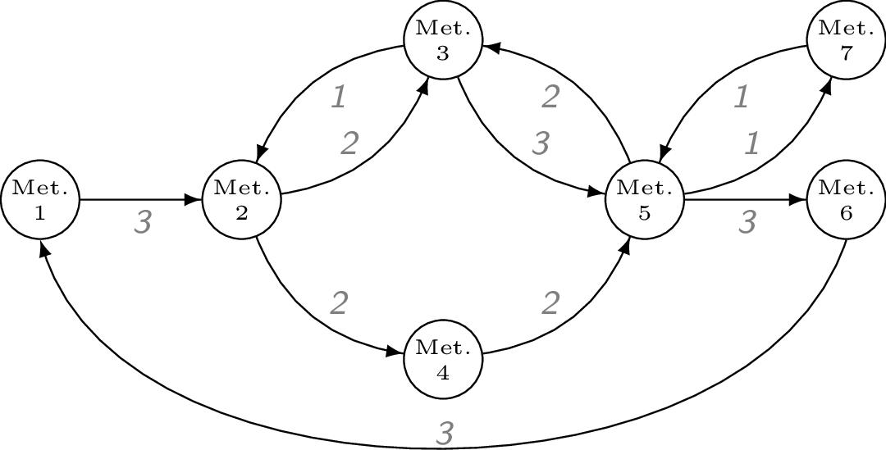
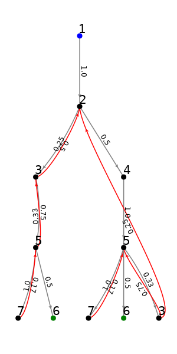
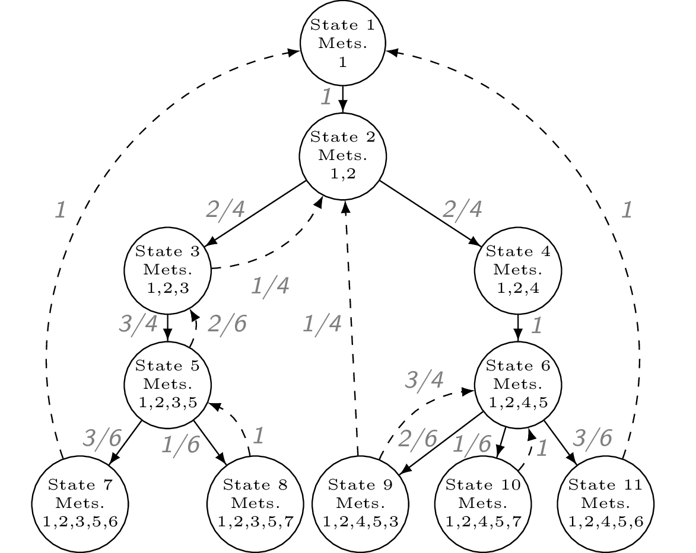

# Tutorial

This section shows how to use the functions in MarkovWeightedEFMs.jl on the
following example network.



```@setup required
using MarkovWeightedEFMs
```

## Problem statement

Given the metabolic network above, its steady state fluxes, and its
elementary flux modes (EFMs), what is the set of EFM weights that
reconstructs the observed network fluxes?

## Inputs

For this type of problem, we require the following:

1. Stoichiometry matrix of unimolecular reactions (must be unimolecular,
   strongly-connected, and closed-loop!)
2. Steady state fluxes along each reaction.

The network metabolites and reactions are typically encoded in an m by
r stoichiometry matrix S. The steady state flux vector is stored as a
separate vector.

```@example required
using MarkovWeightedEFMs

S = [#
 -1  0  0  0  0  0  0  0  0  0  1
  1 -1  1 -1  0  0  0  0  0  0  0
  0  1 -1  0 -1  1  0  0  0  0  0
  0  0  0  1  0  0 -1  0  0  0  0
  0  0  0  0  1 -1  1 -1 -1  1  0
  0  0  0  0  0  0  0  1  0  0 -1
  0  0  0  0  0  0  0  0  1 -1  0
]
v = [3, 2, 1, 2, 3, 2, 2, 3, 1, 1, 3]
nothing # hide
```

We can check that the flux vector satisfies the steady state requirements.

```@example required
all(S * v .== 0) # should evaluate as true
```
## Solving for EFM sequences, probabilities, and weights

The following function applies our cycle-history (discrete-time) Markov
chain method to compute the network EFMs, their steady state EFM
probabilities, and weights. By default, the last parameter is 1 and can be
omitted from the function. This parameter is the (arbitrary) initial state
to root the cycle-history Markov chain. The choice of root state does not
change the EFM probabilities or weights and is explained further in the
section below.

```@example required
efms = steady_state_efm_distribution(S, v, 1)
```

The enumerated EFM sequences are
```@example required
efms.e
```

The corresponding EFM probabilities are
```@example required
efms.p
```

The corresponding EFM weights are
```@example required
efms.w
```

Note: there is possibly an unexplained bug with the discrete-time Markov
chain function `QuantEcon` package used to compute the steady state
probabilities of each state. Sometimes, NaNs are returned from
`steady_state_efm_distribution` and running the code again seems to return
the proper solution.

We can check that the EFM weights reconstruct the observed network fluxes

```@example required
E = reshape_efm_vector(efms.e, S) # matrix of EFM weights
E * efms.w ≈ v # passes
```

A binary EFM matrix with rows = # reactions and columns = # EFMs can be
converted back to the array of EFM sequences by

```@example required
reshape_efm_matrix(E, S)
```

## Visualizing the Markov chain

Our algorithm for computing EFM probabilities is to model steady state
flux network as a cycle-history Markov chain. This is a discrete-time
Markov chain of a certain transformed flux network. For further details,
please read the accompanying paper in the Citation section. The network
structure looks similar to a prefix tree although there exist certain
upstream edges linking children to parent nodes. This network must be
rooted on a starting metabolite, although the choice of root does not
affect the final EFM probabilities. By default, index 1 is chosen as the
root if this parameter is omitted. To visualize the transformed network:

```julia
using GLMakie # Makie backend
GLMakie.activate!()
tree_plot(T, 1) # the last parameter is the rooted metabolite index
```



If using the GLMakie backend, ensure OpenGL is installed on your machine
and accessible by Julia. The GLMakie plot is interactive and allows users
to drag nodes and zoom in/out. Otherwise, you could choose another backend
such as CairoMakie to generate and save a static plot. A prettier,
hand-coded version of the transformed network is shown below.




